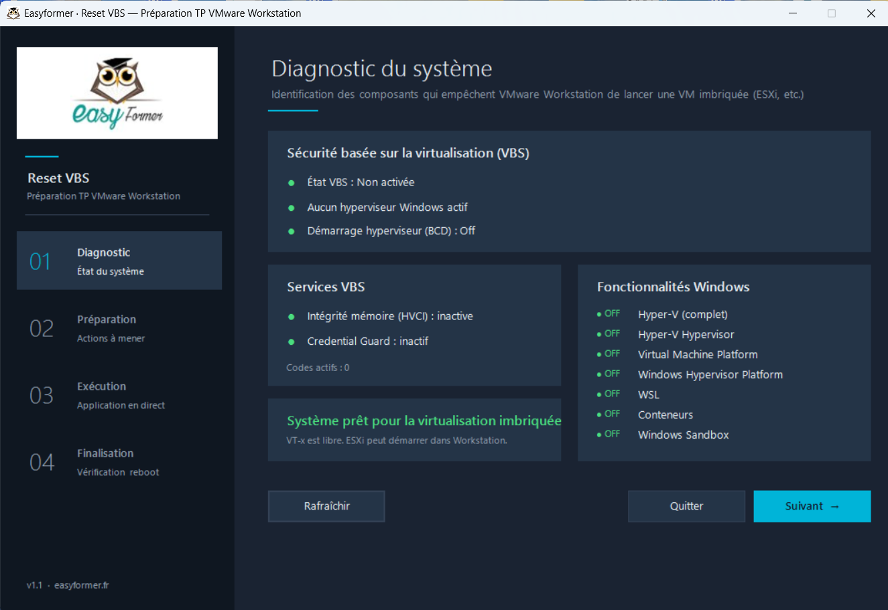

# Reset VBS — Préparation TP VMware Workstation

> Outil graphique de désactivation de la pile de virtualisation Windows, conçu pour les TP de la plateforme TSSR d'Easyformer.

<p align="center">
  
</p>

---

## À quoi sert cet outil

Sur les TP de **virtualisation imbriquée** (ESXi dans VMware Workstation, Hyper-V de labo, GNS3 avec routeurs virtuels, etc.), Windows 10/11 monopolise les instructions VT-x du processeur via toute une pile de protections : **VBS**, **HVCI** (intégrité mémoire), **Credential Guard**, **Hyper-V** et la **Windows Hypervisor Platform**.

Tant que ces protections tournent, VMware Workstation refuse de démarrer une VM ESXi avec l'erreur classique :

```
VMware Workstation does not support nested virtualization on this host.
Module 'HV' power on failed.
```

Cet outil **diagnostique** l'état exact de chacun de ces composants, **propose** les remédiations adaptées, **applique** les modifications avec un journal en direct, puis **vérifie** que tout est bien en place avant le redémarrage.

---

## Fonctionnalités

- **Wizard en 4 étapes** : Diagnostic → Préparation → Exécution → Finalisation
- **Diagnostic complet** des composants liés à la virtualisation :
  - État VBS (`Win32_DeviceGuard`)
  - HVCI (intégrité mémoire) et Credential Guard
  - `bcdedit hypervisorlaunchtype`
  - 10 fonctionnalités Windows (Hyper-V, VMP, WHP, WSL, Conteneurs, Sandbox…)
  - Clés de registre Device Guard et LSA
  - Détection d'un hyperviseur réellement actif en mémoire
- **Sélection à la carte** des remédiations, chacune **expliquée** dans l'interface
- **Journal en temps réel** horodaté, avec niveaux colorés (`OK`, `WARN`, `ERR`, `STEP`)
- **Auto-élévation administrateur** (UAC) — pas besoin de lancer PowerShell en admin au préalable
- **Re-vérification post-exécution** avant le redémarrage guidé
- **Interface 100 % en français**

---

## Installation et utilisation

### 1. Téléchargement

Téléchargez le fichier `Reset-VirtualizationStack.ps1` depuis ce dépôt (bouton **Code** → **Download ZIP** ou directement dans les releases).

### 2. Déblocage du fichier

Windows marque tout fichier téléchargé comme « provenant d'Internet ». Faites un **clic droit** sur le fichier `.ps1` → **Propriétés** → cochez **Débloquer** en bas → **OK**.

Alternative en PowerShell :
```powershell
Unblock-File .\Reset-VirtualizationStack.ps1
```

### 3. Lancement

**Méthode recommandée** : double-clic sur le fichier (ou clic droit → **Exécuter avec PowerShell**).

L'outil détecte qu'il n'est pas en admin et **se relance automatiquement** via UAC. Acceptez l'élévation.

**Si l'ExecutionPolicy bloque** :
```powershell
powershell -ExecutionPolicy Bypass -File ".\Reset-VirtualizationStack.ps1"
```

---

## Important — Le redémarrage et la touche F3

Après l'exécution, **un redémarrage est obligatoire** pour que VBS et l'hyperviseur Windows soient effectivement déchargés.

**Au boot suivant**, Windows peut afficher un **écran bleu ou violet** demandant de confirmer la désactivation de Credential Guard ou Device Guard :

> *« Êtes-vous sûr de vouloir désactiver Credential Guard ? »*

**APPUYEZ SUR `F3`** pour confirmer la désactivation.

⚠️ Si vous ratez cet écran, Windows rechargera silencieusement les protections et il faudra recommencer.

L'outil rappelle cette consigne à chaque étape pertinente — lisez bien les encarts.

---

## Ce que l'outil modifie

| Composant | Action |
|---|---|
| `bcdedit hypervisorlaunchtype` | Mis à `off` (l'hyperviseur Windows ne se charge plus au boot) |
| `HKLM\…\DeviceGuard\EnableVirtualizationBasedSecurity` | Mis à `0` |
| `HKLM\…\DeviceGuard\RequirePlatformSecurityFeatures` | Mis à `0` |
| `HKLM\…\DeviceGuard\HypervisorEnforcedCodeIntegrity` | Mis à `0` |
| `HKLM\…\DeviceGuard\Scenarios\HypervisorEnforcedCodeIntegrity\Enabled` | Mis à `0` |
| `HKLM\…\Lsa\LsaCfgFlags` | Mis à `0` (désactivation Credential Guard) |
| Fonctionnalité `Microsoft-Hyper-V-All` | Désactivée via DISM |
| Fonctionnalité `VirtualMachinePlatform` | Désactivée |
| Fonctionnalité `HypervisorPlatform` | Désactivée |
| Fonctionnalité `Microsoft-Windows-Subsystem-Linux` | Désactivée |
| Fonctionnalité `Containers` & `Containers-DisposableClientVM` | Désactivées |

Chaque action est **optionnelle** et présentée avec une case à cocher, pré-cochée uniquement si elle est nécessaire sur la machine cible.

---

## Vérification post-redémarrage

Après le reboot et la confirmation `F3`, ouvrez **`msinfo32`** et vérifiez la section bas :

- **Sécurité basée sur la virtualisation** → `Non activée` ✅
- La ligne **« Un hyperviseur a été détecté »** doit **avoir disparu** ✅

Ensuite, lancez votre VM ESXi dans VMware Workstation : le module HV doit se charger sans erreur.

---

## Pré-requis matériel

L'outil ne fait que désactiver les protections logicielles côté Windows. **La machine hôte doit déjà** :

- Avoir **Intel VT-x** ou **AMD-V** activé dans le BIOS/UEFI
- Avoir **EPT** (Intel) ou **RVI** (AMD), généralement activés en même temps que VT-x
- Tourner sur Windows 10 ou 11, **Pro** ou **Entreprise** de préférence

Pour les TP ESXi imbriqué, on conseille **8 Go de RAM minimum** allouables à la VM (16 Go d'hôte recommandé).

---

## Dépannage

<details>
<summary><strong>« Impossible d'exécuter le script car il contient une instruction #requires »</strong></summary>

Symptôme : message `ScriptRequiresElevation`.

C'est un ancien bug corrigé en v1.1. Téléchargez la dernière version du script.
</details>

<details>
<summary><strong>L'élévation UAC ne se déclenche pas</strong></summary>

Lancez manuellement PowerShell **en administrateur**, puis :
```powershell
Set-ExecutionPolicy -Scope Process -ExecutionPolicy Bypass
.\Reset-VirtualizationStack.ps1
```
</details>

<details>
<summary><strong>VBS revient après redémarrage</strong></summary>

Deux causes fréquentes :

1. **Vous avez raté l'écran F3** au démarrage. Relancez l'outil et redémarrez en guettant l'écran.
2. **Une stratégie de groupe** (édition Entreprise / poste joint à un domaine) réactive VBS. Ouvrez `gpedit.msc` → **Configuration ordinateur → Modèles d'administration → Système → Device Guard** → mettre **« Activer la sécurité basée sur la virtualisation »** sur **Désactivé**.
</details>

<details>
<summary><strong>« Virtualized Intel VT-x/EPT is not supported on this platform »</strong></summary>

L'outil a tout désactivé côté Windows mais le BIOS ne fournit pas VT-x. Vérifiez dans le BIOS/UEFI :
- **Intel Virtualization Technology** : `Enabled`
- **VT-d / IOMMU** : `Enabled`
</details>

<details>
<summary><strong>Erreur d'encodage / accents bizarres dans la console</strong></summary>

Le fichier est livré en **UTF-8 with BOM**. Si vous avez modifié le script et perdu le BOM, ré-enregistrez-le en `UTF-8 with BOM` (par exemple via Notepad → Enregistrer sous → Codage).
</details>

---

## Réactivation des protections

L'outil **ne propose pas** de mode « réactivation » : pour rétablir VBS et l'hyperviseur, allez dans **Sécurité Windows → Sécurité des appareils → Isolation du cœur → Intégrité de la mémoire = Activé**, puis redémarrez. Pour Hyper-V, réinstallez les fonctionnalités via **Activer ou désactiver des fonctionnalités Windows**.

---

## Avertissements

⚠️ Cet outil désactive des **mécanismes de sécurité importants** de Windows. Il est conçu pour des **postes de TP/lab** dédiés à la virtualisation, **pas** pour des stations de travail professionnelles manipulant des données sensibles.

Sur un poste pro, **réactivez VBS et Credential Guard** une fois le TP terminé.

---

## Compatibilité

| OS | Statut |
|---|---|
| Windows 11 24H2 / 25H2 (Pro & Entreprise) | ✅ Testé |
| Windows 11 23H2 | ✅ Testé |
| Windows 10 22H2 (Pro & Entreprise) | ✅ Compatible |
| Windows 10 LTSC | ✅ Compatible |
| Windows Server | ⚠️ Non testé, probablement compatible |

PowerShell **5.1** (par défaut sur Windows 10/11) ou **7.x**.

---

## Licence

MIT — utilisation libre dans un cadre pédagogique ou personnel.

---

## À propos d'Easyformer

[Easyformer](https://easyformer.fr) est un organisme de formation spécialisé dans les métiers IT, notamment le titre professionnel **TSSR — Technicien Supérieur Systèmes et Réseaux**. Cet outil fait partie de la trousse d'outillage des PC candidats pour les TP de virtualisation.

---

## Contribuer

Bugs, suggestions ou améliorations bienvenus via les **Issues** ou **Pull Requests** de ce dépôt.
